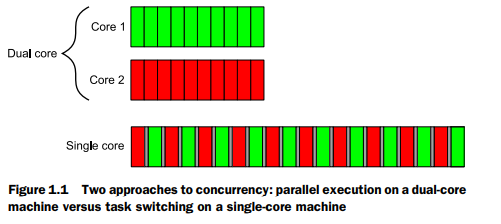
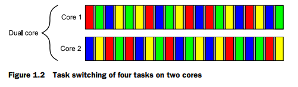
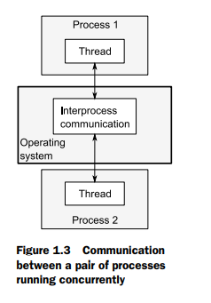
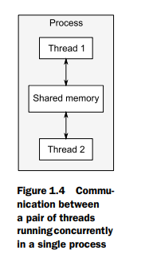
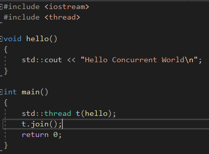

C++11的一个重大特性就是多线程库，不需要依赖特定的平台的线程库。

# What is concurreny?

一个简单并且基础的概念，并发是指两个或多个分离的活动发生在同一时间。

### Concurrency in computer systems

当我们谈论电脑中的并发的时候，我们意味着一个单一的系统并行执行多个独立的活动。

多任务操作系统允许一个电脑去运行多个应用在同一个时间，通过任务切换。

大多数电脑只有一个处理器，一个单一的处理单元或者核心，并且这个到现在还是真的，对于桌面机器。

一个机器可以真正地执行一个任务在一个时间段，**但是它可以切换任务每一秒很多次。**

通过做一点这个任务，然后做另一个任务，**它展现出来任务是发生并行地。**

这个叫做任务切换。

我们依然称这样的系统为并行的，因为任务切换是非常快的，你不能说明在哪个时间点，一个任务可能是悬挂的，因为处理器切换到另一个。

任务切换提供了一个并行的假象到用户和应用程序之间。

一个电脑假无论是有个处理器，或者一个处理器里面有多个核，这些电脑是真正并行有能力地跑超过一个任务，我们叫这个为硬件并发。

这张图展示了一个理想的情景，对于一个电脑，拥有两个任务精准地要去做。

每个分成10个相等大小的块。

注意，单核心上面，每个小任务之间是有灰色的块，表示之间有一点点间隙。

为了执行交错，系统不得不去执行一个上下文切换每次，当它从一个任务切换到另一个任务的时候，

**这个消耗时间。**

为了执行上下文切换，OS必须保持CPU的状态和当前运行任务的指令指针，执行哪个任务要被切换，

并且重新加载CPU的状态，对于当前要切换的任务。

CPU将不得不对于新任务，加载指令和数据的内存到Cache中，阻止CPU执行任何执行，**将造成进一步延迟。**

一些处理器可以执行多个线程在一个核心上。

即使系统有真正的硬件并发性，那也是很容易有超过硬件数量的任务可以并行执行，因此任务切换仍然被用在这些情况下。

四个任务的任务切换在两个核心上。这个图片理想上分割成了大小相同的块。

实际上，一些问题将导致划分不均匀的并且规划也不均等。

## Apporaches to concurrency

并发的解决方法。

**这里会产生一个问题，就是共享资源的问题。**

第一种解决方法就是有多个单线程处理器，第二种解决方法是有多个线程在单个处理器里面。

可以合并这些形式，可以有多个处理器，一些是多线程的，并且一些是单线程的，但是原则都是一样的。

## Concurrency with multiple processes

多个处理器的并发。

第一种使用并发的方式在一个应用中，是去分离应用到多个，分离的，单线程的进程，在同一时间运行。

分离的进程可以传递消息到彼此之间通过所有普通内部的进程的交流通道(信号，socket，文件，管道等)。

两个进程之间的通信的方式。

一个负面的影响是这样的在进程中的交流是复杂的去设置或者缓慢。

因为操作系统典型地提高一些保护在进程之间，去避免一个进程突然地修改属于另一个进程的数据。

另一个负面影响是这里有一个固有的开销在运行多个进程的时候，花费时间去开始一个进程，

**操作系统必须致力于内部的资源去管理进程。**

优点是高层的交流机制意味着它可以轻松地写出安全的代码，而不使用线程。

对于并发，使用分离的进程的另一个额外的好处是，你可以运行分离的进程在不同的机器，通过网络进行连接。

即使这个增加了交流消耗，在一个谨慎设计的系统上，它可以是一个性价比高的方式去提升可用的并行，并且可以提升性能。

## Concurrency with multiple threads

另一种可选的解决方式去运行多个线程在一个进程上。

线程是轻量级的进程，每个线程彼此之间独立地运行，每个线程可能运行一个不同的指令的序列。

但是在一个处理器上的所有线程分享共同的地址空间，并且大多数数据可以直接访问，

比如全局变量，对象的指针或者引用，或者数据可以在线程之间传递。

但是它是复杂的去设置并且经常难以去管理。

这张图展示了一个进程的两个线程的交流，通过共享内存。

如果数据被多个线程访问，**应用程序员必须保证确保每个线程看到的数据视图是一致的**，无论何时访问。

进程之间的通信需要依赖平台相关的API，这本是聚焦于一个进程之间的多个线程。

# Why use concurrency?

这里有两个主要的理由去使用并发在一个应用中：关注点的分离和性能。

这是唯一的理由。

## Using concurrency for separation of concerns

关注点的分离几乎总是一个好的想法，当书写软件的时候，通过组织相关的代码在一起，并且保持不相关的代码分离，你可以使得你的应用轻松地去理解并且测试，因此不太可能包含漏洞。

你可以使用并发去分离功能不同的区域，甚至当操作在这些不同的区域，需要去发生在相同的时间。

一个性能铭感的应用，比如DVD应用，它有两个需要的考虑的部分，第一部分是解码图片和声音，

第二部分是用户的操作，分离这两个不同的线程，不会让它们缠绕在一起，并且它们之间可以进行交互。

## Using Concurrency for performance

芯片厂商在最近几年更倾向于多核设计，比如2，4，16，甚至多个处理器在一个芯片上。

作为结果，多核心桌面程序，甚至多核心嵌入设备，现在目前快速地增加是密切相关的。

这里有两种方式去使用并发对于性能来说。第一种，最明显的，是分离一个任务到多个部分，

并且每一部分并行地运行，因此减少了总的运行时间。这是任务相似点。

即使这个听起来很直接，但是这是一个复杂的过程，因为这里可能有依赖在不同的部分。

划分要么依据过程-一个线程执行一部分算法，当另一个线程执行一个不同的部分，或者依据数据，

一个线程执行相同的操作在数据不同的部分。**这个后面的方法被叫做数据并行。**

那些容易被并行性影响的算法通常被称为令人尴尬的并行。

令人尴尬的并行算法有一个可扩展性的属性，当可用硬件线程的数量提高的时候，算法的并行性可以提高起来去匹配。

第二个方式，对于性能，去提高并发，是去使用可用的并行去解决大的问题，而不是处理一个文件在一个时间点，是处理2或者10或者20。即使这真的只是一个**数据并行**(data parallelism)的应用，同时地通过执行相同的操作在多个数据集上，这里只有一些不同的焦点。

吞吐量的提升通过这种方式可以实际上使得新的可能的事物，比如提高视频处理的分辨率，例如，图片的不同区域可以并行地处理。

## When not to use concurrency?

唯一的理由不使用并发是**当收益不及开销的时候**。

代码使用并发是难以理解的，在大多数情况下，所以，这里有个直接脑力的消耗去书写和保持多线程代码，

并且额外的复杂度可以导致很多bug。

除非潜在的性能获取是足够大的，或者分离的关注部分足以清晰地证明额外的开发时间被需要，使得能够让它正确，并且关联到保留的多线程代码的额外开销，否则就不要使用并发。

同样，性能的获取可能不能像希望的一样大，这里有一些固有的消耗当联系到开启一个线程的时候，

**因为OS必须去分配相关联的内核资源还有栈空间，并且添加一个新线程到调度程序，这些都会花费时间。**

如果线程上执行的任务很快完成，那么任务所花的时间相对于开启这个线程来说相形见绌，

可能导致应用的整体性能变差，如果任务已经直接被生成的线程直接执行的话。

除此之外，线程是有限的资源。如果你有多个线程同时运行，这个会花费OS的资源，并且会导致整个系统作为整体跑的更慢。不仅这样，但是使用过多的线程会消耗可用的内存或者地址空间，对于一个处理器来说，因为每个线程需要一个分离的栈空间。

通过线程池可以被用来限制线程的数量，但是这不是万全之策(silver bullet)，它们也有自己的问题。

服务器程序使用线程池进行优化，可以提供优化后的性能。

线程用的越多，操作系统要切换的上下文越多。

# Concurrency and multithreading in C++

通过多线程的标准并发的支持对于C++来说，是一个新事物。

## History of multithreading in C++

1998年的C++标准不承认线程的存在，并且不同语言元素的可使用效果被书写，依据一个连续的抽象机器。

不仅那样，但是内存模型没有正式地被定义，如果你没有编译器确切的扩展的话，是不能书写多线程应用，

对于1998年的C++标准来说。

当然，编译器厂商是免费去添加扩展到语言中的，并且对于多线程的C APIs的流行来说-这些POSIX C标准，还有微软的API-已经使得很多C++编译器厂商去支持多线程，使用不同的平台确切的扩展。

应用程序框架比如MFC，还有通用目的的C++库，比如Boost和ACE，已经累积大量的C++类，包裹了潜在的平台相关的API，并且提供高层次的机制，对于多线程来说，用来简化任务。

一个尤其重要的设计，在很多C++类库中非常寻常的，并且提供了深思熟虑的益处对于程序员来说，

已经被用于RAII，对于锁来说，确保互斥量(mutex)被解锁，**当相关的作用域退出的时候。**

由于标准支持的缺少，这里会有些原因，线程感知模型的缺少导致的问题，尤其，对于那些想尝试去获取更高的性能通过使用处理器硬件的知识，或者对于这些书写跨平台代码，它们的实际行为是什么，因平台而异。

## Concurrency support in the new standard

这里不仅有一个新类型线程感知内存模型，但是C++标准库已经被扩展去包括类，这些类用来管理线程，

保护共享数据，线程之间的同步操作，还有低层次的原子操作。

新的C++线程库在很大程度上基于先前的经验累积，通过使用之前提到的C++类库。

尤其是，Boost线程库已经被用来作为主要的模型，对于新的库来说。新的库的数据结构的名字还有类名

在Boost中都有对应的。

在C++中，对于原子操作的支持，使得程序员能够有能力书写有效的代码，使用确定的语义，不需要平台确切相关的汇编语义。

## Efficiency in the C++ Thread Library

如果你追求最好的表现，这是非常重要的去理解实现消耗，关系到使用任何高层次的设施，通过比较直接使用潜在的低层次的机制，这个耗费叫做抽象惩罚。

C++标准委员会已经非常敏感的，当设计C++标准库的时候，并且标准C++线程库尤其是，

一个设计目的是直接使用低层次的APIs的时候，应当没有什么益处获得，当同样的机制被提供的时候。

**库因此被设计起来去允许有效的实现(使用一点非常低的抽象惩罚)，在大多数主流平台上。**

C++标准委员会的另一个目标是确保C++为那些希望接近金属的人提供无尽的性能。

为了这个，沿着新的内存模型，**带来了丰富的原子操作库**，对于直接的控制独立的bits还有bytes，

以及线程间同步和任何更改的可见性。

这些原子类型，还有相应的操作，可以被用在多个地方，比如开发者之前去使用的平台确切的汇编的语义。

C++标准库也提供了高层次的抽象和机制，使得书写多线程代码轻松的并且更少的错误。

使用这些机制会带来一些性能的开销，因为额外的代码必须执行。

但是这个性能开销不是意味着高抽象的开销，通常，相比于手写来说，

这样的开销不是高的，**编译器可能会内联大量额外的代码。**

一些罕见的情况下，这些没有用的机制将导致其它代码的性能。

手写带来的额外的复杂度还有出错的概率超过收益。

大部分情况下，不是库的问题，而是你应用设计的问题，应该重构你的程序。

不是尝试去缩减一小点互斥操作的时间，更倾向于重新设计应用，使得互斥之间的争执更少。

设计应用去减少争执，在第8章节覆盖。

## Platform-specific facilities

为了获取轻松访问这些设施，同时不放弃标准C++线程库带来的收益，

C++标准线程库提供了一个native_handle()成员函数，允许潜在的平台实现，

被直接地使用，通过一个平台特定的API。

但是这些内容超出了本书。

# Getting started

唯一真正的区别是一些函数是共同执行的，那么你需要保证共享数据是安全的，对于同时的访问。

## Hello，Concurrent World

保护共享数据的声明在其它头文件。

&lt;thread&gt;里面主要声明了函数和类，用了管理线程。

每个线程都有一个初始化函数，是新线程执行的开始地方。对于应用的初始线程来说，是main()，

但是对于每一个其它线程来说，它被描述在std::thread对象的构造函数里面。

名叫t的std::thread对象有一个新函数hello()作为它的初始化函数。

在新线程启动后，(std::thread t(hello))这句话，初始线程持续地执行，

如果它不等待新线程完成，它将愉快地执行到main函数的末尾，从而可能在新线程有机会运行之前结束执行。

**这也是为什么叫join()，这会导致调用线程main去等待std::thread的线程。**

join有叫连接的意思。

