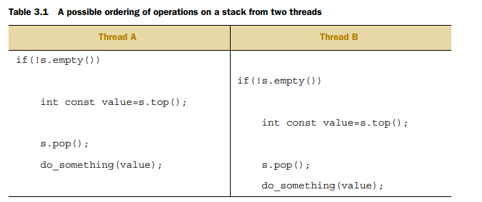

对于并发，使用线程的关键的一个好处就是潜在地去轻松和直接地在它们之间共享数据。


对于线程之间的共享数据，你需要去有规则，当什么时候，哪个线程可以访问数据的哪个bit，

并且**其它更新**如何被在其它线程之间进行交流，用来关心数据。

这种情况，数据可以在单个应用中的多个线程之间进行共享不仅只是一个好处-它也可以是坏处。


这章是关于安全的共享数据在C++的线程之间，避免潜在的问题会提起，最大化益处。


# Problems with sharing data between threads


线程之间的共享数据的问题是由于修改数据的原因。

**如果所有的共享数据是只读的**，这是没有问题的，因为数据被一个线程只读，是不会被影响的，不管另一个线程是否读取相同的数据。


一个概念，广泛的用来帮助程序员理解他们的代码，**是invariants(不变式)**-强调一个特定数据结构的里面总是为真的东西，例如，这个变量包含了item的数量在列表中。这些invariants被经常破坏，在更新中。


考虑一个双向链表，每个节点持有一个指针指向下一个节点还有上一个节点。

其中一个不变式是，如果你随着一个next指针从一个节点A到一个另一个节点B，previous指针从节点B指回节点A。为了从列表中移除一个节点，节点在任何一侧需要去被更新，去指向其它东西。

一旦已经被更新，invariants将被破坏，直到另一侧的节点已经被更新了，再更新完毕之后，invariant重新持有了。


从一个链表中删除一个条目的情况如下：


1.标识一个节点要被删除(N)

2.更新链表从N前面的节点指向后面的节点

3.更新链表从N后面的节点指向前面的节点

4.删除节点N


**b和c之间破坏了这种不变式。**


最简单的修改数据的潜在问题是，在线程之间共享数据会破坏invariant。

如果一个线程读取双向链表，当另一个移除一个节点，它是相当有可能的，对于读取线程去查看链表的时候，一个节点

被部分移除，因此invariant被破坏了。

不管结果如何，这是bug中最常见的原因的一个例子，在并发代码中：**叫做竞争条件。**


## Race conditions


假设你去买票去看一场电影在电影院。

如果它是一个大电影，多个出纳员将会收钱，因此同一时间，会超过一个人可以买票。

如果一些人在出纳员的桌子上，同样也购买了你所希望购买的票，哪一张供你选择的票可用，取决于其它人是否第一个预定或者是你第一个预定。如果这里只有一些座位留下来，这个差异会更加明显：这可能是字面上的一场竞争去看谁会获得最后一张票。这叫做**竞争条件(race condition)**，哪个座位你可以得到(或者甚至是否你可以得到票)

依赖于两个出纳员的相对购置。


在并发里面，一个竞争条件是任何结果取决于操作执行的相对顺序在两个或者三个线程上，线程各自执行它们的操作。


大多数时间，这是相当温和的，因为所有可能的结果都是可以接受的，**即使它们可以改变，因为相对顺序的差异。**


例如，如果两个线程添加元素到一个队列中进行处理，通常情况下不用关心哪个元素是第一个加入的，前提是系统的不变式是保留的。那是当竞争条件导致不变式被破坏了，这将是一个问题，就像是上面的那个双向链表的问题一样。


C++标准也定义了一个术语**数据竞争(data race)**去表示竞争条件的确切类型，因为并发修改到一个单一物体，

**数据竞争导致令人害怕的未定义行为。**


有问题的竞争条件经常发生在完成一个操作，需要修改一个或者多个不同片段的数据上，例如例子中两个链表的指针。

因为操作必须访问两个分离的不同的片段，这肯定是修改在分离的指令上，并且另一个线程可以潜在地访问数据结构，当只有它们其中一个已经被完成的时候。


竞争条件可以是经常难以去发现并且难以去复制，因为机会的窗口期是非常小的。

如果修改被完成通过连续的CPU指令，问题出现的概率在任何一个贯穿件上都很小，即使数据结构被另一个线程并发地访问。

他几乎是不可避免的，这样的问题将会在大多数不方便的时间展示。因为竞争条件通常是时间敏感的，

他们会经常完整地消失，当应用跑在debugger下的时候，因为debugger影响了程序的计时，即使它是轻微地。


如果你在写多线程程序，竞争条件会轻松地成为你生活中的祸根，写软件的一大复杂性使用并发**来自于避免有问题的竞争条件。**


## Avoiding problematic race conditions

这里有几种方式去解决有问题的竞争条件。最简单的选项是去包裹你的数据结构，使用一个保护机制，

去保证只有一个线程真正地执行一个修改，**可以看到间接的状态**，不变式破坏的地方。


从其它线程访问数据结构的视角来看，这样的修改要么还没有开始要么还没有完成。

C++标准库提供一些机能，会在这个章节进行描述。


另一个选项是去修改数据结构的设计还有它的不变式，使得修改能够**被一系列不可分割**的操作完成，每一个保持住了不变式。这个通常倾向于作为**无锁编程**并且是非常困难地去使得正确。


内存模型在第5章，无锁队列编程在第7章。


另一种解决竞争条件的方式，是去处理数据结构的更新，作为**事务(transaction)**，就像更新数据数据库

一样的事务。

被要求的一系列数据修改和读取被存储到一个事务log，并且然后被提交到一个单一的步骤。

如果提交不能继续前进，因为数据结构已经被另一个线程修改了，那么事务将重启。

这个是被术语话的叫做**软件事务内存(software transactional memory)(STM)，**这是一个激活的调查区域在书写的时间点。这个不会在本书中覆盖，因为这里没有直接的支持对于STM在C++里面。

然而，私有地做一些事情的基础概念还有然后提交在一个步骤，后续会讲解。


最基础的机制，保护共享数据，**通过C++的标准，是mutex。**


# Protecting shared data with mutexes


将访问数据结构的所有代码段标记为**互斥的(mutually exclusive)**，然后如果一个线程在修改，另一个线程想访问这段代码的时候，必须要等修改完成。


我们可以使用一个同步原子被叫做**锁(mutex)(mutual exclusion)**。在访问一个共享数据结构之前，你锁定关联到那个数据的锁，并且当你完成访问那个数据结构的时候，你解锁这个mutex。


线程库然后保证了一旦线程已经将一个确切的mutex锁住，那么所有其它的线程尝试去锁定相同的mutex，必须去等待直到成功锁定了那个mutex的线程解锁它。这个保证了所有的线程看待共享数据**是自洽的(self-consistent)，**没有任何破坏的不变式。


Mutexes是最通用的可用的数据保护机制在C++中，但是它不是一个万能解药，它是非常重要的去构造你的代码去保护正确的数据，并且避免竞争条件固有的在你的接口内。Mutexes有自己的问题，在一种叫做**死锁(deadlock)**的形式下，并且保护要么太多，要么太少的数据。


## Using mutexes in C++

在C++，你创建一个mutex，通过构造一个std::mutex的实例，通过锁定它，使用一个成员函数lock()，

解锁它，使用一个调用到成员函数unlock()。

然而，那是实际上不推荐地直接调用成员函数，因为这样意味着你必须去记住调用unlock()在一个函数的所有代码路径之外，包括这些由于异常的代码。代替地，标准C++库提供了std::lock_guard类模板，实现了RAII模式对于一个mutex，它锁定一个提供地mutex在构造函数里面，并且解锁它在析构函数里面，因此保证了一个锁住的mutex总是正确地解锁。


下面的代码展示了如何去保护一个链表，可以被多个线程访问，使用一个std::mutex，并且使用std::lock_guard。

它们都被声明在&lt;mutex&gt;中。


在add_to_list()中使用std::lock_guard&lt;std::mutex&gt;并且在一次在lis_contains()里面，意味着在这些函数里面访问是互斥的，list_contains()不会看到通过add_to_list()修改到中途一半的链表。


通常情况下，那是寻常地去组织mutex还有受保护的数据一起，在一个类里面，而不是使用全局变量。

这是一个标准的应用面向对象的规则：通过把它们放置在一个类里面，你是清晰地标记它们为相关的，

并且你可以封装它们在函数里面，并且强制性地保护。

这种情况下，函数add_to_list和list_contains将变成类的成员函数，并且mutex和受保护的数据将变成类的私有成员，使得它容易地去确定哪段代码可以访问数据，并且哪段代码需要去锁住mutex。


但是，如果成员函数其中之一返回一个指针或者引用到受保护的数据，那么它不关心成员函数所有都锁定了mutex在一个非常好的有顺序的范式下，因为你已经在保护上炸了一个打动。

**使用mutex保护数据因此需要小心的接口设计**，为了保证mutex被锁定，在这里有任何访问受保护的数据之前，并且这里没有后门。


## Structuring code for protecting shared data

在一个层面上，检查迷失的指针或者引用是轻松的，只要没有一个成员函数返回一个指针或者引用受保护的数据到它们的调用者，通过它们的返回值或者通过一个输出参数。

如果深入一点，事情就变得不简单了。就像检查成员函数不要传递指针或者引用到它们的调用者，那也是非常重要的去检查它们不会传递这样的指针或者引用到它们调用的函数里面，不在你的控制之下。

这是相当危险的，这些函数可能存储指针或者引用在一个地方，之后它可以被用来没有收到mutex的保护。


特别危险的是，在这种注视下，函数在运行时被提供，通过一个函数参数或者其它的方法。


问题出在，用户定义的函数func，foo可以传入一个malicious_function，从而绕开保护，然后调用do_something()，没有mutex锁定的情况下。


在好的一面看来，你有一个指导如下，会帮你解决这些情况：

不要传递受保护的数据成员的指针和引用到lock的作用域之外，是否从函数返回它们，将它们存储在外部可见的内存中，或作为用户提供的函数的参数。


但是这远远不是唯一的陷阱。


## Spotting race conditions inherent in interfaces

定位固有的竞争条件在接口中。


为了一个一个线程能够安全地删除一个节点，你需要去保证你在阻止并发访问到3个节点，被删除的节点和周围的节点。


如果单独地保护每个受保护的访问的节点的指针，不使用互斥的代码不会比使用互斥的代码好。

因为竞争条件依然存在，**需要保护的不是单个节点的各个步骤，而是整个数据结构，**对于整个删除的操作来说。

最简单的解决方法在这个情况下，是去有一个单一的mutex，保护整个链表。


只是因为在链表上的独立的操作是安全的，你还没有脱离危险，你仍然会得到竞争条件，甚至在一个简单的接口下。


考虑一个stack数据结构，就像std::stack适配器一样。

除了构造函数和swap，**这里有5钟事情你可以在std::stack上去做。**


如果你改变top()让它只能返回一个拷贝，而不是一个引用，并且保护内部的数据，使用mutex，这个接口仍然是固有的从属于竞争条件。这个问题不是唯一的，对于一个基于锁的实现，**它是一个接口问题，**

因此竞争条件将依然发生在一个无锁实现上。


问题出现在这两个操作上，这两个操作是无法依赖的。


即使它们可能正确的，在调用的时候，一旦它们已经返回，其它线程是可以任意地访问stack，并且能够push()新的元素进去，或者pop()到stack里面，在线程调用empty()或者size()之前，可以使用那些信息。


特别的，如果stack实例不是共享的，那是安全地去检查empty()然后再调用top()去访问顶部的元素，

如果stack不为空。

```c++
stack<int> s;
if(!s.empty())
{
    //empty()和top()之间会产生问题
	int const value = s.top();
    //top和pop之间会产生问题
	s.pop();
	do_something(value);
}
```


它不仅在单线程代码中是安全的，它要求是：调用top()在一个空的stack上是未定义的行为。

使用一个共享的stack对象，这个调用序列将不再变得安全，因为这里可能一个线程调用pop()去移除最后的元素在调用empty()还有调用top()之间。**这是一个经典的竞争条件问题**，并且在内部使用一个锁去保护栈的内容，并不能阻止它，**这是接口设计的后果。**


解决方式是修改接口。然而，这仍然会产生问题：就是应该做一些什么改变呢？


最简单的方式，你可以声明top()**抛出异常**，如果这里没有元素在栈里面，当它调用的时候。

即使这个直接地解决了这个问题，它依然是一个更加笨重的编程，因为你需要catch一个异常，即使

empty()的调用返回false。


这里依然有一个潜在的问题，对于另一个竞争条件，在调用top()和pop()之间。


如果stack被保护，被一个内部的mutex，只有一个线程可以运行一个stack成员函数在任意一个时间点，

那么调用会很好地交错，当do_something()的调用可以并发地运行的时候。



一个操作的可能的顺序在一个栈中，对于两个不同的线程。


如果这有这些线程在运行，那么对top()的两次调用之间就没有任何内容可以修改堆栈，因此两个线程将看到相同的值。


按道理来说，应该看到不同的值的，但是它们获取到了同样的value。

作为结果，栈上的两个值中的其中一个在未读取的情况下被丢弃，而另一个则会被do_something处理两次。


这里是另一个竞争条件，并且非常的隐晦，对于empty()/top()的未定义行为来说。

这个调用导致了接口的根本的改变，**一个就是合并了top()和pop()的调用在mutex的保护之下。**

TomCargill指出这样的一个合并调用会导致一个问题，**对于对栈上的一个对象的拷贝构造，会抛出异常。**


考虑一个stack&lt;vector&lt;int&gt;&gt;。现在，一个vector是一个动态的大小的容器，那么当你拷贝一个vector，库必须去分配相同大小的内存从堆中，目的是为了拷贝内容。如果系统负载很严重，或者这里有一个严重的资源限制，

这个内存分配会失败，因此vector的拷贝构造会抛出一个std::bad_alloc异常。如果vector保护很多元素，这种情况很容易发生。如果pop()函数被定义去返回弹出的值，就像从栈中移出去一样，你会有一个潜在的问题：

被弹出的值被返回给调用者，只有在栈已经被修改过后，**但是拷贝值到返回给调用者的过程可能会抛出异常。**

如果这个发生了，被弹出的数据会丢失，它已经从栈中移出，但是拷贝没有成功！

std::stack接口有助于将接口分成两部分：获取顶端元素(top())还有从它的栈中移除元素(pop())，

**如果你不可以安全地拷贝数据，它将依然留在stack里面。**

如果问题是由于内存的缺少，应用可以释放一点内存，然后重试。


不幸的是，在消除竞争条件时，你正试图避免这种分离！


这里有几种选择方式，可以进行解决。


### OPTION1：PASS IN A REFERENCE

第一种选项是传递一个变量的引用，在调用pop()时，**希望在该变量中接受作为参数的弹出值：**

```c++
std::vector<int> result;

some_stack.pop(result);
```

**把top和pop合并了，这里。**

也就是pop接受引用参数，然后把值传出去。


这个在多数情况下工作的很好，但是他有清晰的缺点，它需要调用代码去构造一个栈的值类型的实例在调用之前，

目的是传递的时候**作为目标**。


对于一些类型，这是不切实际的，因为构造一个实例是非常昂贵的，依据时间或者资源。

对于其它类型，这个不总是可能的，因为构造需要参数，这不一定可用在代码的这一点上。

最终地，**它需要存储的类型可以赋值。**这是一个非常重要的限制：一些用户定义的类型不支持赋值，

即使它们可能支持移动构造或者甚至是拷贝构造(并且因此允许通过传值返回)。


### OPTION2：REQUIRE A NO-THROW COPY CONSTRUCTOR OR MOVE CONSTRUCTOR


要求一个不抛出异常的拷贝构造或者移动构造。


这里只有一个异常安全的问题，对于一个返回值的pop()函数，如果通过值返回可以抛出异常的话。

一些类型，有拷贝构造的，将不会抛出异常，**并且伴随着新的右值引用的支持在C++标准中。**

一些更多的类型将会有一个移动构造，不会抛出异常，甚至它们的拷贝构造也是这样做的。


一个有效的选项是限制使用你的线程安全的stack到这些类型，**可以安全地被返回通过传值，没有抛出异常。**


即使这是安全的，它也不是理想的。

尽管你可以在编译期间检测一个拷贝或者移动构造的存在是否抛出异常，使用std::is_nothrow_copy_constructible并且std::is_nothrow_move_constructible类型萃取。

这里有一些更多的用户定义的类型，它们的拷贝构造可以抛出异常，并且不会有移动构造，

相比于那些类型不会抛出异常的拷贝和移动构造。这将是不幸的，**如果这样的类型不能存储在你的线程安全的栈里面。**


### OPTION 3：RETURN A POINTER TO THE POPPED ITEM

第三个选项是返回一个指针到弹出的元素而不是传值返回该元素。

优势在于指针可以完全自由地拷贝，而不需要抛出异常，那么你就避免了Cargill的异常问题。


缺点在于返回一个指针需要一种管理内存的手段到对象，并且对于简单类型，比如整数，这样的内存管理开销

会超过只返回通过传值返回类型的开销。对于任何接口使用这个选项的，

std::share_ptr将会是一个很好的选择，对于指针类型，不仅是它避免了内存泄漏，因为对象被销毁了，

一旦最后一个指针被删除，对象就会被销毁，但是库是出于内存管理方案的完整控制下的，并且不需要去使用new和delete。这是非常重要的，对于优化目的：要求在栈中的每个对象会被单独地分配，使用new，将迫使一些开销，相比于原先非线程安全的版本。


### OPTION 4：PROVIDE BOTH OPTION 1 AND EITHER OPTION 2 OR 3

要么提供选项1和选项2，或者选项1和选项3。


灵活性应当不能被受到限制，特别是通用代码。如果你选择了选项2或者选项3，它是相对地轻松的去提供选项1。并且这为你的代码的用户**提供了能力**去选择哪一个选项是最正确的对于它们来说，只需要很少的额外成本。


#### EXAMPLE DEFINITION OF A THREAD-SAFE STACK

一个线程安全栈的定义的例子。

一个类定义，对于一个栈，没有竞争条件在接口上，并且使用条件1和条件3来实现。

这里有两个重载的pop()，一个输入一个引用，存储值的位置，另一个返回std::shared_ptr&lt;&gt;。


通过削减接口，允许最大的安全，甚至在整个栈上的操作是受到限制的。

接口从pop和top变为一个pop。


栈它本身不能被赋值，因为操作被删除了，这里没有swap函数。

**但是，它可以被拷贝，假设了栈元素可以被拷贝。**

pop函数抛出一个empty_stack异常，如果栈是空的，所有的事物依然会工作正确，即使栈被一个调用empty()修改后。


选项3，使用std::shared_ptr允许栈去关心内存分配问题，并且避免了严重的调用到new和delete如果被要求的话。

你的五个栈操作已经现在变成了三个：push()，pop()和empty()。甚至empty是多余的。

接口的简化允许更好地控制数据，你可以保证mutex被锁住，对于整个的一个操作。


这个栈的实现是实际上的可拷贝的-拷贝构造lock了mutex在源对象上，**并且然后拷贝了内部的栈。**


拷贝在构造函数结构体内部而不是初始化列表，为了保证mutex被保持住，在拷贝的过程中。


top()和pop()导致竞争条件的问题在于锁的粒度太小了，保护不能覆盖完整的一个渴望的操作。

mutexes的问题也可能是锁的粒度太大了，最极端的情况就是一个单一的全局锁保护了所有的共享操作。

在一个系统中，这里有大量的共享数据，这个会消除并发带来的任何收益，因为线程被强制在一个时间点执行，即使当它们访问不同的一点数据的时候。Linux内核的第一个版本被设计起来去处理多线程系统，

使用了一个单一的全局内核锁。即使这个能够工作，也意味着一个双核处理器系统经典地具有最糟糕的性能，相比于单处理系统，而在四处理器系统上的性能也远远不够四个单处理器系统。


内核里面有太多的争执，因此线程跑在额外的处理器上，是不能够执行有用的工作的。

之后的Linux版本已经移动到一个细粒度的锁定方案中。


细粒度锁方案的一个问题是，有时候，你需要超过一个mutex锁定以保护操作中的所有数据。

就像前面描述的，有时候正确的要去做的事情是提高被mutexes覆盖的数据的粒度，因此只有一个mutex

需要被锁定。然而，那是不受人欢迎的，例如当mutexes被用来保护一个类分离的实例的时候。

这种情况下，下一级锁定意味着要么将锁定留给用户，要么使用一个单一的互斥锁去保护该类的所有实例，这两种情况都不是特别需要的。


如果你以两个或多个mutexes对于一个操作，**这里会存在另外一个潜在的问题潜伏：死锁(deadlock)。**这是一个几乎相对于竞争条件的：与其说两个线程争先恐后，不如说每一个线程都在等待另一方，

两人都没有取得任何进展。

## Deadlock：the problem and a solution

一对线程需要去锁定彼此的mutexes去执行一些操作，并且每个线程有一个mutex并且彼此之间正在等待。这个情景叫做死锁，它是一个最大的问题，当必须去lock两个或者多个互斥量的时候，目的是为了执行一个操作。


最通用的建议去避免死锁总是锁定两个互斥量在相同的顺序：**如果你总是锁定mutexA在mutexB之前，**

你就不会产生死锁。有时候这是直接的，因为mutexes被提供为不同的目的，

但是一些情况这是不简单的，例如当mutexes各自保护同一个类的一个单独实例时。

考虑一下，例如，一个操作在一个类的两个实例中进行数据的交换，为了保证数据交换成功，

没有被并发的修改所影响，mutexes在两个实例中都要被锁定。

然而，如果一个固定的顺序被选中(例如，实例的互斥锁被提供作为第一个参数，然后实例的互斥锁被提供作为第二个参数)，这会适得其反：**只需要两个线程在相同的两个实例之间尝试交换数据，你就会死锁！**


**相同的实例，会导致死锁。**


C++标准库有一个措施解决这个，以std::lock的形式，一个函数，可以同时锁定两个或多个mutexes同时，

而且没有死锁。


首先，参数被检查用来保证它们是不同的实例，因为企图去请求一个lock在一个std::mutex上，当你已经持有它的时候，是一个未定义的行为。(但是一个mutex可以允许被同个线程多次lock，以std::recursive_mutex的形式被提供)。然后，调用std::lock，锁定了两个互斥量，然后两个std::lock_guard被构造，每一个mutex一个。std::adopt_lock参数被提供，除了mutex，为了向std::lock_guard对象**指示**mutexes已经被加锁了，

并且他们应当采用了现有的lock的所有权在mutex上，而不是企图去lock mutex在构造函数里面。


**总的意思说**，用std::lock一次性锁定lhs和rhs的锁，而std::lock_guard则负责解锁，但是要**指示它**不要给lhs.m和rhs.m加锁，因为已经被std::lock锁定了。


这个保证了mutexes在通用的情况下(受保护的操作可能抛出异常)，在函数退出的时候，mutexes是正确的被解锁了，它也同样允许一个简单的返回。还有，不值得要么锁定lhs.m或者rhs.m在调用std::lock的时候，可以抛出异常，在这种情况下，异常会传播到std::lock。如果std::lock已经成功地要求一个lock在一个mutex上，并且一个异常被抛出，当它尝试去请求锁定一个lock在另一个mutex上地时候，**第一个lock就会自动释放。**std::lock提供了要么全都有，要么全都没有的语义，关于锁定提供的互斥锁。


std::lock无法帮助你，如果这些加锁的请求是分离的。

死锁是无法避免的，在多线程的代码中。然而，**这里有一些相对简单的准则**，可以帮助你去书写没有死锁的代码。


## Futher guidelines for avoiding deadlock

进一步的指导，对于避免死锁。


死锁不只是发生在lock上，即使它们是最频繁的情况，你可以创建死锁，使用两个线程，并且没有锁定，

通过让每个线程调用join在std::thread对象上，对于双方。

在这种情况下，没有线程可以前进，因为它需要等待另一个线程完成。

**对于避免死锁的指导是：不要等待另一个线程，如果这里有一个机会让你等待的话。**


这里有一些独立的指导提供了一些方式，**去标识和消除让其它线程等待的概率。**

### AVOID NESTED LOCKS

避免内嵌的锁定。


第一个想法是最简单的，不要请求一个锁，如果你已经持有一个了。

如果你需要请求多个锁，把它作为一个单一的行为，**使用std::lock，为了让它们没有死锁。**


### AVOID CALLING USER-SUPPLIED CODE WHILE HOLDING A LOCK

避免调用用户提供的代码，当持有一个LOCK的时候。

因为代码是用户提供的，你不知道它做了什么，它可以做任何事情，包含要求一个锁。

如果你调用了一个用户提供的代码，当持有一个锁的时候，并且那个代码也要求一个锁，

你已经违背了那个指导，避免内嵌的锁，并且会获取一个死锁。

有时候这是难以避免的，如果你在书写同样代码例如stack，**每个在参数类型上的操作是用户提供的代码。**

**这种情况下，你需要一个新的指导。**


### ACQUIRE LOCKS IN A FIXED ORDER

要求锁在一个固定的顺序。


如果你绝对需要要求两个或多个locks，并且你不可以请求它们作为一个单一的操作，使用std::lock。

**接下来最好的事情是请求它们在同样的顺序在每个线程中。**


关键是定义顺序，在一种方式下，它在多个线程中是一致的。

大多数情况下，这是相对的简单的。例如，我们之前那个栈的mutex在每个栈实例的内部，

但是**存储在stack中的数据项**的操作要求用户提供的代码。


你可以，然而，添加一个约束，**在栈中的数据项的任何操作应当不会影响到栈本身自己。**

这个放置了负担在栈的使用者上，**但是存储在容器中的数据是很少访问容器的**，当这种情况发生的时候，这是相当明显的，因此它不是一个尤其困难的负担。


在其它情况下，这不是那么直接的，就像之前那个swap函数。

至少，在那个情况下，你可以同时锁定mutexes，但这个不总是有效的。

回过去看那个链表的例子，你将会看到一种可能性，**对于保护链表，让每个节点都有mutex。**


然后，为了去访问链表，线程必须请求一个锁在它感兴趣的每个节点上：要被删除的节点和它周围的节点，

因为他们都将被修改在一些方式下。同样地，为了遍历一个链表，线程必须持有lock在它当前的节点上，当前它请求lock在序列中的下一个节点的时候，**以确保下一个指针在此期间不会被修改(不会被其它人修改)。**一旦下一个节点的lock已经被请求了，上一个lock就可以被释放，因为它不会再被需要了。


这种手把手的锁定风格允许多个线程去访问链表，前提是每个都是访问不同的节点。

然而，为了去阻止死锁，节点必须总是被锁定，在相同的顺序下：如果两个线程尝试去遍历链表在相反的顺序下，使用手把手的风格，**他们可能会彼此之间死锁在链表中间的时候。**

如果节点A和节点B在链表之间相邻的话，线程将尝试去持有一个lock在节点A上，并且尝试去请求一个lock在节点B上。一个线程持有一个lock在节点B上请求一个lock在节点A上-**一个经典的死锁情节。**


同样地，当删除节点A和C之间的节点B的时候，如果那个线程要求在B上加锁在锁定A和C之前，

它有潜在的死锁，当有一个线程逆序遍历的时候。这样的一个线程尝试去锁定A或者C第一步

(依赖于遍历的方向)，但是它会发现它不能得到一个lock在B上，因为另外一个线程在做删除，持有了节点B的锁，并且尝试在节点A和节点C上加锁。


一种在这里阻止死锁的方式是去**定义一种遍历的顺序**，**因此一个线程总是锁定A在B之前，并且B在C之前。**

这个将消除死锁的可能性，以不允许反向遍历为代价。同样的约定可以建立起来，为其它数据结构。

### USE A LOCK HIERARCHY

即使这是一个真正的特定情况，对于定义锁的顺序，一个锁的层级可以提供一种检查的方式，在运行时遵守该约定。想法是你分割你的应用到很多层，并且标识所有那些可能锁定在给定的层级上的互斥锁。


当代码尝试去锁定一个互斥锁，它是不允许去锁定那个互斥锁，**如果它已经持有从一个更低的层级获取的锁。**你可以检查这个在运行时，通过赋值每层的数字到每个互斥量，并且持续地记录哪个互斥量被哪个线程锁住。


thread_a()遵守规则，所以它跑的很好。另一方面，thread_b()忽视了这个规则，并且因此会在运行时

失败。thread_a()调用high_level_func()，锁定了high_level_mutex(层级值是10000)并且

然后调用low_level_func()，使用锁定的互斥量，对于high_level_stuff()来说，为了获取参数。

low_level_func()然后锁定了low_level_mutex，但是这是好的，因为这个互斥量有一个更低的

层级值5000。


thread_b()在另一方面不是很好，第一，它锁定了other_mutex，它的层级值只有100。

这意味着它应当真正保护超低层次的数据。当other_stuff()调用high_level_func()，

它因此违背了层级：high_level_func()尝试去请求high_level_mutex，有一个10000的值，

远远超过当前的层次值100。hierarchical_mutex将因此报出一个错误，可能地通过抛出一个异常

或者报告给程序。在层次mutexes间的死锁因此不可能了，因此mutexes它们强制了锁的顺序。

意味着你不可以持有两个锁在同一时间，如果它们在同一层级，那么手把手的锁定方案要求在

链中的mutex有一个更低的层级值相比于前面一个，有可能是不切实际的在某些情况下。


这个例子也证明了一点，使用std::lock_guar&lt;&gt;模板和一个用户定义的mutex类型。

hierarchical_mutex不是标准库的一部分，但是是容易去写的，

它可以通过std::lock_guard&lt;&gt;使用，因为它实现了三个成员函数去满足mutex的概念：

lock()，unlock()，还有try_lock()。

try_lock()相当简单，如果在mutex上的lock被另一个线程持有，它会返回false，而不是等待

直到调用线程可以请求一个lock在mutex上。它也可以被std::lock()内部地使用，作为避免死锁的算法。


这里的关键是使用thread_local的值，表示层级值对于现在的线程，this_thread_hierarchy_value。

它被最大值初始化，**因此初始地任何mutex可以被锁定**。因为它被声明为thread_local，每个线程都有自己的拷贝，因此，一个线程中变量的状态完全独立于从另一个线程读取时变量的状态。


因此，第一时间，一个线程锁定了一个hierarchical_mutex实例的值this_thread_hierarchy_value为ULONG_MAX。就其本质而言，这个值大于任何一个值，因此check_for_hierarchy_violation()通过。

lock()委托到内部的mutex做了真正的锁定。**一旦这个锁定成功了，你可以更新层级值。**


如果你现在锁定另一个hierarchical_mutex，同时持有一个lock在这个上面，

那么this_thread_hierarchy_value的值反应了第一个锁的层级值。**那么第二个mutex的层级值必须现在**

**低于已经持有的mutex**，目的是为了检查去通过。


现在，那是非常重要的去保存前面层级的值，对于现在的线程，那么你可以恢复它，通过unlock()。

否则你将不能够去锁定一个mutex，再次使用一个更高级的层级值，即使这个线程没有持有任何锁。


try_lock()工作起来就像lock()一样，除了如果调用try_lock()在internal_mutex上失败，

那么你将不会持有lock，那么你就不可以更新层级值，并且返回false，而不是true。


即使检测是一个运行时的检查，它至少没有时间上的依赖-**你不需要等到竞争条件导致的死锁出现的时候**

**才展出来**。同样的，设计过程要求去分隔应用和mutexes在这种方式下，可以消除一些造成死锁的原因，

在他们被书写的时候。

### EXTENDING THESE GUIDELINES BEYOND LOCKS

死锁不仅发生在lock上，它可以发生在任何会导致一个等待环的同步构造上。

因为它是值得扩展这些指导去覆盖这些情况的。

例如，就像你尽可能应当避免请求内联的locks一样，这是一个坏主意去等待一个线程，当持有一个lock的时候，

因为那个线程需要请求一个lock为了前进。同样地，如果你准备去等待一个线程去完成，它可能是值得标识一个线程的层级，**那样一个线程只会等待一个比它层级低的线程。**


一旦你已经设计了你的代码去避免死锁，std::lock()和std::lock_guard()覆盖了大多数情况的简单锁定，

但是有时候更多的灵活性是被需要的。对于这些情况，**标准库提供了std::unique_lock模板。**

就像std::lock_guard，**这是一个类模板被参数化mutex类型，并且它提供了同样的RAII风格的管理**，就像std::lock_guard一样，但是一些更多的灵活性。

## Flexible locking with std::unique_lock

使用灵活的锁std::unique_lock。


std::unqiue_lock比std::lock_guard提高了一些灵活性，**通过释放invariant。**


std::unqiue_lock不总是拥有它关联的mutex。

可以传递std::adopt_lock作为第二个参数到构造函数，让lock对象管理lock在一个mutex上，也可以传递

std::defer_lock作为第二个参数，标识mutex在构造函数里面是解锁的。


lock可以**之后被请求**，通过调用lock()在std::unique_lock对象上(不是mutex)，或者通过传递std::unqiue_lock

它自己到std::lock()上。


std::unique_lock相比于std::lock_guard需要更多的空间，还有一点比例的缓慢程序。

灵活性，允许std::unique_lock实例不需要去拥有互斥锁mutex是有代价的，这个信息必须被存储，并且必须被更新。


std::unique_lock对象可以被传递到std::lock，因为std::unqiue_lock提供了lock()，try_lock()，

还有unlock()成员函数。

在潜在的mutex下，同名的成员函数被转发去做实际的工作，并且在内部更新了std::unique_lock实例的flag，

**去标识是否mutex现在是否被那个实例所拥有。**

这个标识是非常重要的，为了去保证unlock()被正确地在析构函数里面调用。

如果实例拥有mutex，析构函数必须调用unlock，如果实例没有mutex，就不能调用unlock。

**这个flag可以被查询，通过调用owns_lock()成员函数。**


因为flag需要存储起来。因此，std::unqiue_lock对象是经典地大于std::lock_guard对象的大小。

这里也有些抽象惩罚，因为flag需要去被更新和检查。


这里有一些情况，std::unique_lock更适合手头的任务。

因为你需要去确认额外的灵活性。一个例子就是deferred locking，延迟锁定，**还有一个例子就是lock的所有权要从一个作用域移交到另一个。**


//55


