# Synchronizing concurrent operations

同步并发操作。


这章覆盖的内容：

1.等待一个事件

2.等待一次性(one-off)的事件，使用futures

3.等待一个时间限制

4.使用同步操作去简化代码


有时候不仅需要去保护数据，同时也要**同步不同线程上的操作。**


一个线程可能需要**去等待另一个线程完成一个任务**，在第一个线程可以完成它自己任务的时候。


通常，那是普遍的，想让一个线程去等待一个确定的事件发生或者一个条件为true。

即使这是可能的完成，通过定时地检查一个"task complete"flag，或者一些相似的东西在共享数据里面，这也是离理想情况很远的。


C++标准库提高了一些机制来处理这个，**通过condition variables和futures的形式。**


这个章节，会讨论如何去等待一个event，使用条件变量和futures。

**并且使用它们来简化同步操作。**


# Waiting for an event or other condition


如果一个线程等待另一个线程完成任务，它有一些选择。

第一，检查一个flag在共享数据上(被mutex保护)，然后让另一个线程去设置这个flag，当任务完成的时候。这在两方面有浪费：线程消耗了宝贵的访问时间，重复地检查flag，当互斥量被等待线程锁定的时候，它不能被其它任何线程锁定。

这两种方式都影响了线程的等待，因为他们限制了一个线程等待的可用的资源，并且阻止了它去设置那个flag。这个类似(akin)于在夜晚保持清醒，然后和火车司机交谈：他不得不把火车开的慢一点，

因为你使他分心了，因此他花费了更长的时间到达了这里。

**同样地，等待线程消耗了可以被另一个线程使用的系统资源，并且可能导致等待更长。**


另一种选择是等待线程睡眠一段时间，**在检查和使用std::this_thread::sleep_for()函数之间。**

```c++
bool flag;
std::mutex m;

void wait_for_flag()
{
	std::unique_lock<std::mutex> lk(m);
	
	while(!flag)
	{
		lk.unlock();
		std::this_thread::sleep_for(std::chrono::milliseconds(100));//休眠100毫秒
		lk.lock();
	}
}
```


在这个循环里面，**函数解锁了互斥量在睡眠之前**，并且在之后锁定了它，所以另一个线程有机会请求它，

并且设置这个flag。


这是一个巨大的提升，因为线程不会浪费处理时间，当它睡眠的时候，**但是这是非常困难地设置睡眠时间。**

太短的睡眠时间会浪费处理时间的检查，太长的睡眠时间，线程会持续睡眠，即使它等待的线程已经完成了任务，导致一些些延迟。


第三种，更推荐的，去使用C++标准库的机制，**去等待一个事件。**

最基础的机能用来等待一个事件，被另一个线程所触发的是**条件变量。**

概念上地，一个条件变量被联系到一些事件或者其它的条件，并且一个或者多个线程可以等待这个条件变量直到满足，然后，它可以**notify**一个或多个等待该条件的线程，以便唤醒它们并允许它们继续处理。


## Waiting for a condition with condition variables

使用条件变量等待一个条件。


C++标准库提供了两个条件变量的实现：std::condition_variable和std::condition_variable_any。

它们都声明在&lt;condition_variable&gt;库头文件中。

两种情况下，它们都需要和mutex一起工作，目的是为了提供正确的同步，前面的受限于只能和std::mutex一起工作，鉴于后者可以任何一起工作，但是需要符合一些最小的标准，使得看起来像mutex，因此有着_any后缀。


因为std::condition_variable_any更加的通用，这里会有额外的成本，依据大小来看，性能，

或者操作系统资源，那么std::condition_variable应当更受欢迎，除非额外的便利性被需要的话。


使用条件变量的例子如下：

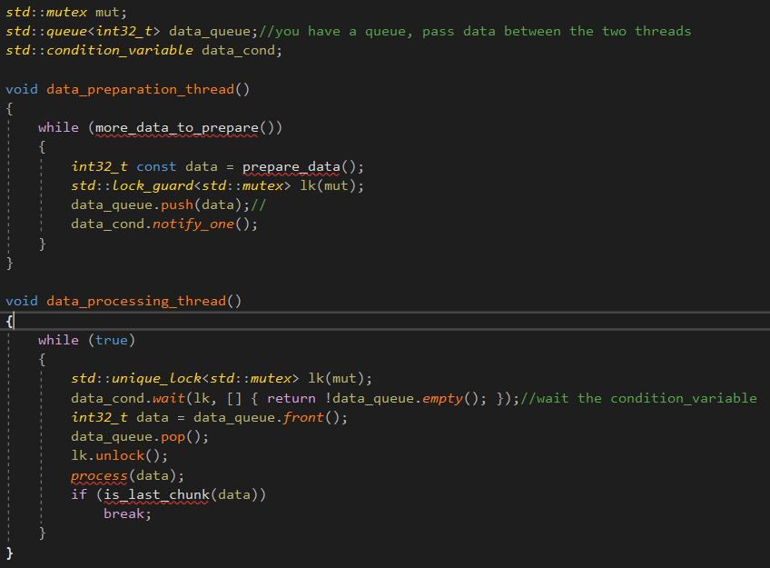

首先，有一个队列，用来在两个线程之间传递数据。当数据准备好了之后，线程准备数据，并且锁定互斥量，

保护队列，使用std::lock_guard，并且压入数据到队列中。然后，它调用notify_one()成员函数在条件变量实例，

**去通知等待线程。**


你还有一个处理线程。这个线程首先锁定了互斥量，但是使用了std::unique_lock而不是std::_lock_guard，

等会，你将看到为什么。线程然后调用wait()在std::condition_variable，传递了锁对象还有一个lambda表达式，表示条件变量等待的东西。


wait的实现检查了条件，通过调用提供的lambda函数，并且返回它是否满足，如果条件不满足，

wait解锁mutex，并且将线程阻塞或者变成等待状态。

当条件变量被激活，通过一个调用notify_one()，线程将会被唤醒，**重新请求锁定mutex，并且再次检查**

**条件，从wait返回，并且mutex仍然被锁定。**


这也是为什么你需要std::unique_lock而不是std::lock_guard，**等待线程必须解锁mutex，**

等待线程必须解锁mutex，当它在之后等待和再一次锁定的时候，std::lock_guard不提供这个便利性。

如果mutex保持锁定，当线程睡眠的时候，data-preparation线程不能够去锁定mutex，去添加一个item到队列中，并且等待线程将永远看不到条件满足。


在调用wait的时候，一个条件变量可能会检查条件的条件任意多次，然而，它总是在锁定互斥锁的情况下执行此

操作，并且只有当用于测试条件的函数返回true时，才会立即返回。


当等待线程请求mutex，并且检查条件的时候，如果它不是在直接的回复，对于另一个线程的通知，

叫做**虚假唤醒(spurious wak)**。因为任何这样的虚假定义的数量和频率被定义不确定的，不建议使用一个有负面影响的函数对于条件的检查。


std::unique_lock的便利性，不仅用于wait，它也用于一旦你有数据去处理，但是在处理它之前。

处理数据是一个消耗时间的操作，持有一个lock在一个mutex上过长时间是不理想的。


持有一个队列在线程之间转移数据是非常寻常的情况。

同步可以受限在队列它本身，**它减少了同步的大量问题和竞争条件。**


std::unqiue_lock相比于std::lock_guard，提供了解锁的操作，析构函数会判断解锁了没有，如果解锁了，就不再解锁，否则就和std::lock_guard一样，**粒度更细。**


# Building a thread-safe queue with condition variables

构建一个线程安全的队列，使用条件变量。


3.2.3那个是线程安全的栈。


以std::queue&lt;&gt;为适配器的形式如下：

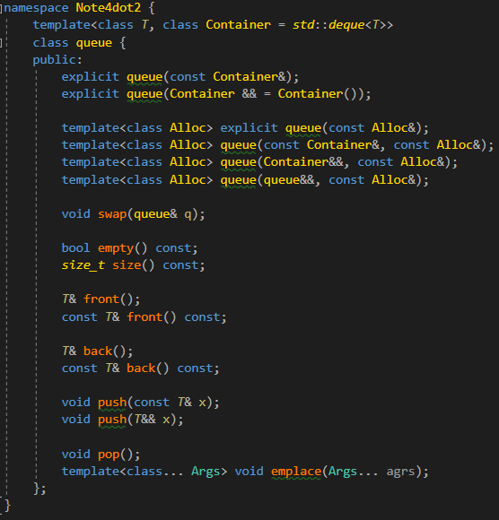

如果你忽略了构造函数，赋值运算符和交互操作，你只剩下三组操作：这些操作询问了队列的状态

(empty()和size())，这些询问了队列的元素(front()和back())，还有这些修改了队列(push(), pop()和emplace())。


就像3.2.3的栈，并且因此你有同样的问题，关于固有的竞争条件，在接口上。

因此，你需要合并front()和pop()到一个函数调用中，就像你合并top()和pop()对于栈来说。

4.1添加了一个细微的差别，当使用一个队列去传递数据在线程之间，接受队列经常需要去等待数据。

让我们提供两个变种在pop()上:try_pop()，它尝试去弹出值从queue，但是立马返回一个值(使用一个暗示失败的值)即使这里没有值可以获取，还有wait_and_pop()，会去等待，直到这里有个值可以获取。

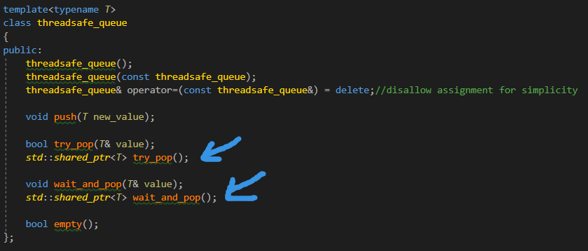

try_pop和wait_for_pop有两个版本。

try_pop的第一个重载版本存储了返回的值在引用的变量上，因此，它可以使用返回的值作为状态，

它返回了true如果它返回一个值，如果失败，返回false。

第二个版本的重载不会这么做，因为它直接返回了值，但是返回的指针可以是null，如果这里没有值可以获取。


它和前面那个queue有什么关系，你可以抽取出代码，对于push和wait_and_pop在这里。

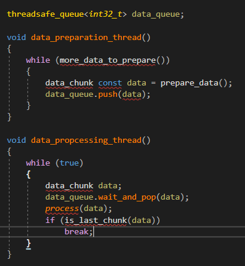

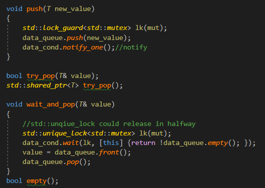

std::unique_lock相比于std::lock_guard的优势，就是，可以在中途释放锁。


可以看到，mutex和条件变量现在包含在threadsafe_queue的实例中，因此分离的变量不再被请求，

没有外部同步的操作被请求，对于调用push来说。

wait_and_pop在内部处理了条件变量的等待。


其它的重载是很容易写的。


最终版本如下：

```c++
	template<typename T>
	class threadsafe_queue
	{
	private:
		mutable std::mutex mut;//mutex must be mutable
		std::queue<T> data_queue;
		std::condition_variable data_cond;
	public:
		threadsafe_queue() {}
		threadsafe_queue(const threadsafe_queue& other)
		{
			std::lock_guard<std::mutex> lk(other.mut);
			data_queue = other.data_queue;
		}
		threadsafe_queue& operator=(const threadsafe_queue&) = delete;//disallow assignment for simplicity

		void push(T new_value)
		{
			std::lock_guard<std::mutex> lk(mut);
			data_queue.push(new_value);
			data_cond.notify_one();//notify
		}

		bool try_pop(T& value)
		{
			std::lock_guard<std::mutex> lk(mut);
			if (data_queue.empty())
				return false;
			value = data_queue.front();
			data_queue.pop();
			return true;
		}
		std::shared_ptr<T> try_pop()
		{
			std::lock_guard<std::mutex> lk(mut);
			if (data_queue.empty())
				return false;
			std::shared_ptr<T> res(std::make_shared<T>(data_queue.front()));
			data_queue.pop();
			return res;
		}

		void wait_and_pop(T& value)
		{
			//std::unqiue_lock could release in halfway
			std::unique_lock<std::mutex> lk(mut);
			data_cond.wait(lk, [this] {return !data_queue.empty(); });
			value = data_queue.front();
			data_queue.pop();
		}

		std::shared_ptr<T> wait_and_pop()
		{
			std::unique_lock<std::mutex> lk(mut);
			data_cond.wait(lk, [this] {return !data_queue.empty(); });
			std::shared_ptr<T> res(std::make_shared<T>(data_queue.front()));
			data_queue.pop();
			return res;
		}
		bool empty() const
		{
			std::lock_guard<std::mutex> lk(mut);
			return data_queue.empty();
		}
	};
```


即使empty()是一个const成员函数，并且其它的参数对于拷贝构造来说，是一个const引用，

其它线程也可能具有non-const的引用对于这个对象，并且调用可变的成员函数，因此我们需要去锁定mutex。


自从锁定mutex是一个可变的操作，因此mutex对象必须是mutable的，**因此它可以被锁定在empty和拷贝构造中。**

也就是说，拷贝构造的参数是一个const引用，但是我们想使用它的mutex，mutex的锁定是可变操作，因此我们需要给它一个修饰符mutable。


条件变量是有用的，对于这里有超过一个线程等待同样的事件。如果线程被用来去分割工作量，并且因此只有一个线程负责通知，4.1的例子是可以使用的，只是跑多个数据的实例-处理线程。当新数据准备的时候，notify_one()的调用会触发并行执行wait()去检查条件变量的线程中的一个，并且从wait()返回(因为你加入了一个数据到data_queue)。这里无法保证哪个线程会被通知，或者即使这里有一个线程等待通知，所有的处理线程可能仍然处理数据。


另一种可能是一些线程正在等待同样的事件，并且它们所有都必须去等待。

这个可以发生共享数据初始化的时候，并且处理线程可以都使用同样的数据，但是需要去等待它被初始化，

或者线程需要去等待共享数据的更新，比如定时地更新。

在这些情况下，**准备数据的线程可以调用notify_all()成员函数在条件变量上，而不是notify_one()。**

就像名字建议的一样，这个造成所有的线程并行地执行wait()去检查它们等待的条件变量。


如果等待线程准备去等待一次，那么当条件为true的时候，那么它将永远不再等待这个条件，

条件变量可能不是最好的同步机制。这个尤其是真的，比如条件被等待，**用于一个特定数据段的可用性，**

在这种情况下，**future**可能会更加正确。


notify_one会唤醒一个线程，而notify_all会唤醒所有的线程。


# Waiting for one-off events with futures

等待一次性的事件，使用future。


假设你要乘飞机去国外度假。一旦你到了机场，并且清除了各种登机手续后，你仍然需要等待通知，你的航班准备好登机了，可能需要几个小时。你可能需要去寻找一些有意义的事件，去渡过事件，比如进行阅读，上网，

或者在价格过高的机场咖啡吃饭，但是最重要的，你需要去等待一件事情：你要上飞机的信号，但是给定的航班只有一次，下一次你要进行的度假，你将等待一个不同的航班。


C++标准库建模了这种一次性事件的顺序叫做future。如果一个线程需要去等待一个确切的一次性事件，

它以某种方式获得了代表这一事件的未来。**线程然后可以在未来的短时间内定期等待，以查看事件是否已经发生。**

(比如查看登机牌)，当执行一些其它任务的时候(比如在昂贵的咖啡厅吃饭)在检查之间。

或者，它可以执行另一项任务，直到需要的事件发生后才能继续，然后等待future做好**ready**。


一个future可能有数据关联着它(例如你的航班在哪个登机口登机)，或者没有。

一旦一个事件已经发生了(并且future已经变得ready)，那么future不能被reset。


这里有两种futures的顺序在C++标准库中，被实现作为两个模板类型声明在&lt;future&gt;库头文件：

**unique futures(std::future&lt;&gt;)还有shared futures(std::shared_future&lt;&gt;)。**这两个在std::unqiue_ptr和

std::shared_ptr后建模。一个std::future的实例是一个也是唯一一个实例，引用了它相关联的事件，

但是多个std::shared_future的实例可能引用相同的事件。


在后面的例子中，所有的实例将变得**ready**在相同的时间，并且它们可能访问关联到事件的任何数据。

这个关联的数据是使用模板的理由，模板参数是关联数据的类型。


std::future&lt;void&gt;，std::shared_future&lt;void&gt;模板特例化应当被用于这里没有关联数据的地方。

即使futures被用于在线程之间进行交流，future对象也不提供同步访问。

如果多个线程需要去访问一个单一的future对象，它们必须保护访问通过一个互斥量或者其它的同步机制，

就像第三章介绍的那样。**多个线程可能每个访问它们自己的std::shared_future&lt;&gt;的拷贝**，不使用更进一步的同步，即使它们都会引用同样的同步结果。


最基础的一次性事件是一个已经运行在后台的计算结果。


第二章的std::thread不提供一个轻松的方式返回一个值从这样的一个任务，但是我许诺这个会被处理在第四章，

现在是看如何解决的时间了。


## Returning values from background tasks


假设你有一个长期运行的计算，你预计最终会产生一个有用的结果，但是你目前不需要该值。

可能你已经找到一个方式去决定去生活。你应当开始一个新线程去执行计算，但是这意味着你必须把结果转回去，

因为std::thread不提供一个直接的机制做这个。这是**std::async**函数模板参与的(同样也声明在&lt;future&gt;)。


你使用std::async去开始一个异步任务，对于你不需要立马的结果。

不像是返回给你一个std::thread对象去等待，std::async返回一个std::future对象，它最终会持有函数的返回值。

当你需要值的时候，你只需要调用**get()**在future上，并且线程会阻塞直到future是ready状态的，然后返回值。

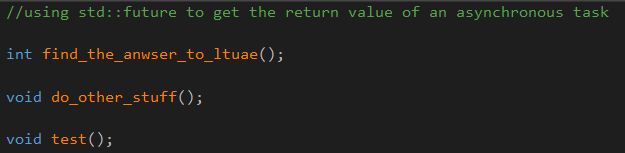

使用std::future从异步任务中获取一个值。

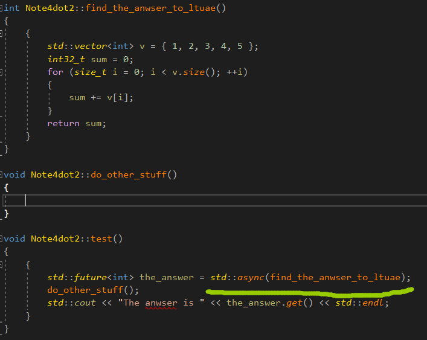


std::async允许你去传递额外的参数到函数中，通过添加额外的参数到调用中，就像std::thread做的一样。


如果第一个参数是一个指针，指向成员函数，第二个参数提供对象，这个对象应用这个成员函数(要么直接地，或者通过指针，要么被std::ref包裹)，剩余的参数被传递作为参数到成员函数中。


如果参数是右值，拷贝会被创建通过移动原先的值。

这个只允许移动操作的类型。


如下图所示：

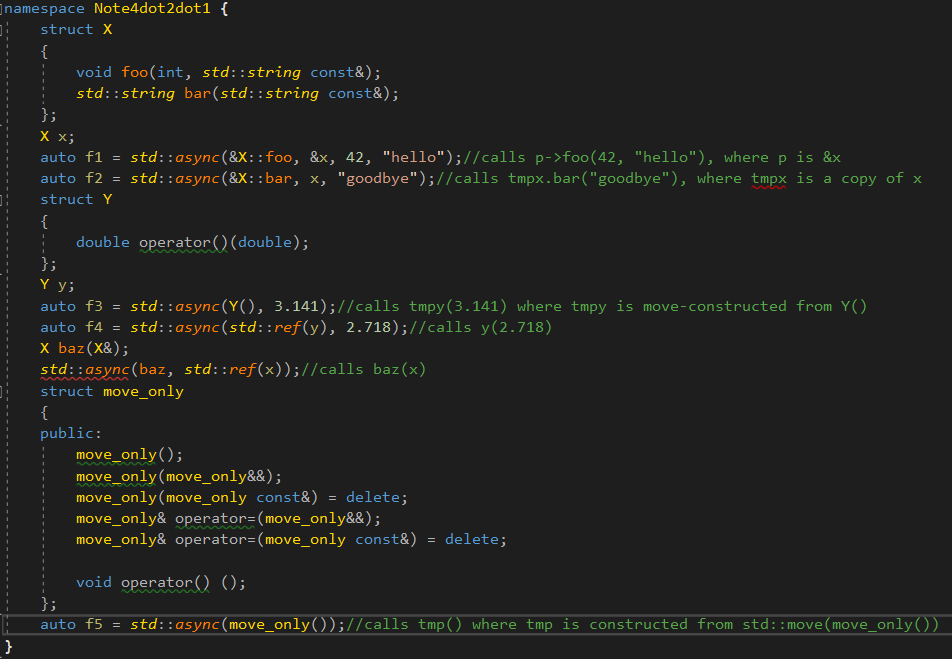


std::async启动新线程取决于实现，或者当future等待的时候，是否任务在同步运行。

大多数情况下这是你所想要的，但是你可以描述去使用一个额外的参数到std::async在函数去调用的时候。

这个参数是std::launch的类型，并且可以是std::launch::deferred去表示函数调用是否要被延迟，直到wait()或者get()在未来被调用的时候，std::launch::async表示函数必须跑在自己的线程上，或者std::launch::deferred | std::launch::async表示实现可能被选择，最后一个选项是默认的。

如果函数是deferred的，它可能真正地不会允许。

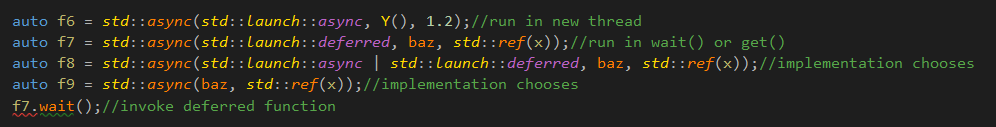

默认情况下，是取决于实现的。


std::async使得它容易去分隔算法到任务中，可以并发地运行。

然而，这不是唯一的方法和一个std::future联系起来，对于一个任务，你可以选择做这件事情通过包裹任务在一个

std::packaged_task&lt;&gt;的类模板中，或者通过书写代码去显式地设置值，使用std::promise&lt;&gt;类模板。

std::package_task&lt;&gt;是一个更高层次的抽象，相比于std::promise。


# Associating a task with a future

std::packaged_task&lt;&gt;关联future到一个函数或者一个可调用对象上。

当std::packaged_task&lt;&gt;被调用的时候，它调用关联的函数或者可调用对象，并且使得future **ready**，

返回值存储作为关联的数据。这个可以被用来作为一个构建的块，对于线程池，或者其它的任务管理主题，

比如运行每个任务在它自己的线程上，或者顺序地运行它们在一个特定背景的线程上。如果大型操作可以被分割成自包含的子任务，这些中的每一个可以被包裹进std::packaged_task&lt;&gt;的实例当中，并且实例被传递进任务规划或者线程池当中。这个抽象出了任务的细节，**规划器处理std::packaged_task&lt;&gt;实例**，而不是独立的函数。


std::packaged_task&lt;&gt;类模板的模板参数是一个函数签名。

当你构造一个std::packaged_task的实例的时候，你必须传递一个函数或者可调用对象，它们可以接受确切的参数，并且那个返回类型兼容确切的返回类型。类型不需要匹配地很精确，你可以构造一个std::packaged_task&lt;double(double)&gt;从一个函数，这个函数接受一个int，并且返回一个float，因为类型进行了隐式地转换。


确切的函数签名的返回值标识了std:future&lt;&gt;的返回类型，从get_future()成员函数中，

然而函数签名的参数列表被用于去描述packaged task's的函数调用操作符的签名，

例如，std::packaged_task&lt;std::string(std::vector&lt;char&gt;*,int)的部分类定义显式在如下：


```c++
//partial class definition for a specialization of std::packaged_task<>
template<>
class packaged_task<std::string(std::vector<char>*, int)>
{
public:
	template<typename Callable>
	explicit packaged_task(Callable&& f);
	std::future<std::string> get_future();
	void operator()(std::vector<char>*, int);
};
```

一个特化版本。


std::packaged_task对象因此是一个可调用对象，并且可以被包裹进std::function对象，传递到std::thread作为线程函数，传递到另一个函数，这个函数要求一个可调用对象，或者甚至直接地调用。

当std::packaged_task被调用作为一个函数对象，被提供的参数到函数调用操作符，被传递进内部包含的函数，

并且返回的值被存储起来作为异步的结果，在std::future，通过get_future()获取。

你可以因此包裹一个task进std::packaged_task，并且取得future，在传递std::packaged_task对象到别的地方之前，由于某些原因。当你需要结果的时候，你可以等待future变得ready。


如下的例子展示了这个行为：


## PASSING TASKS BETWEEN THREADS

在线程之间传递任务。


一些GUI框架要求GUI的更新需要完成在某些确切的线程，

如果另一个线程需要去更新GUI，它必须发送一个消息到正确的线程。

std::packaged_task提供了一种方式做这个，不需要一个自定义的消息对于每一个和每一个GUI相关的活动。


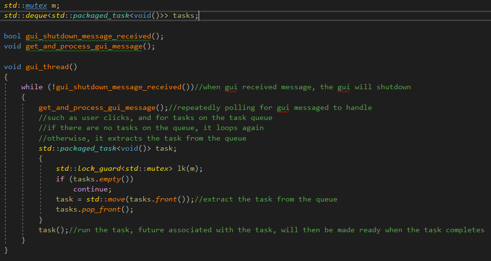

运行task，关联到task的future，将在task运行完毕之后，变得准备。


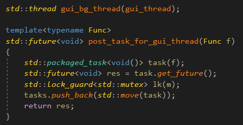

传递一个task到队列中也是相当简单的，一个新的packaged task从提供的函数中被创建，

future从task中获取，通过调用get_future()成员函数，并且task被放置在列表中，在future被返回给调用者的时候。传递消息到GUI线程的代码，可以然后等待future，如果它需要知道task已经完成了，或者它可以扔掉future，如果它不需要去知道。


这个例子使用了std::packaged_task&lt;void&gt;对于task，它包裹了一个函数或者任何其它可调用对象，不接受任何参数，并且返回void(如果它返回任何其它东西，那么返回值会被抛弃)。

这是最简单的可能的任务，但是就像你之前看到的，std::packaged_task也可以被用于复杂的场景-通过描述一个不同的函数签名作为模板参数，你可以改变返回类型和函数调用操作符的参数类型。


那些不能表示为简单函数的任务，或者这些任务可能来自多个地方怎么处理呢？

这些情况可以被解决通过第三种方式，创建一个future:使用std::promise去显式地设置值。


//81


